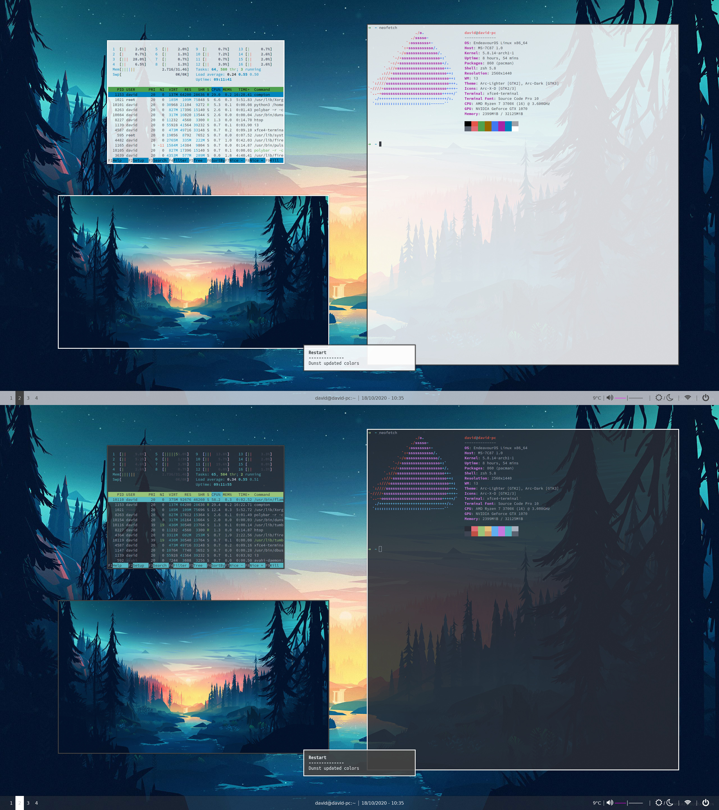
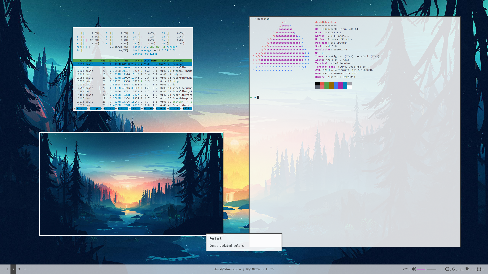
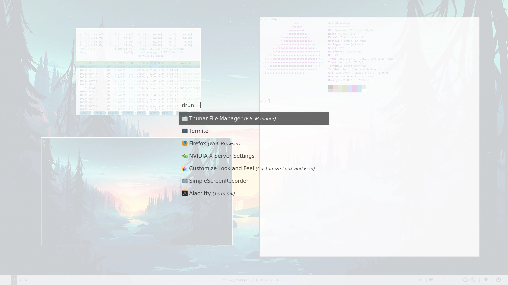
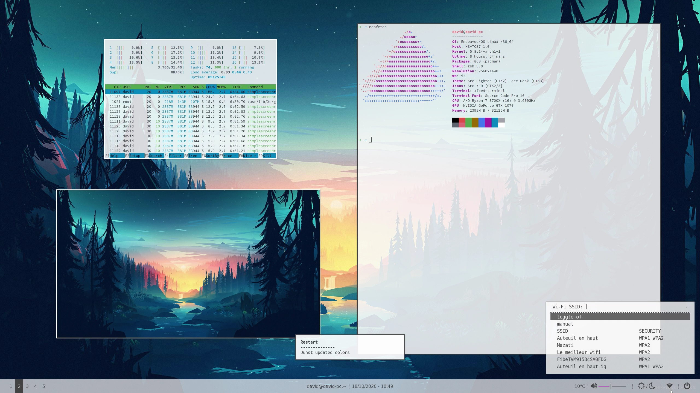
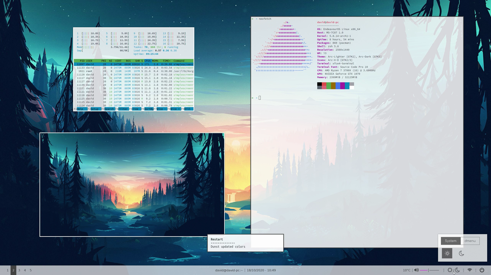
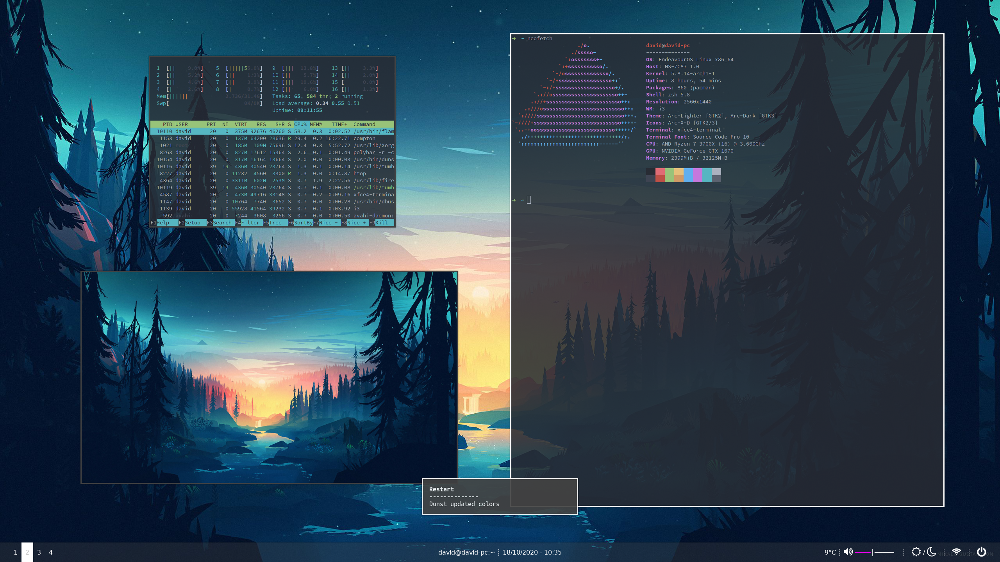
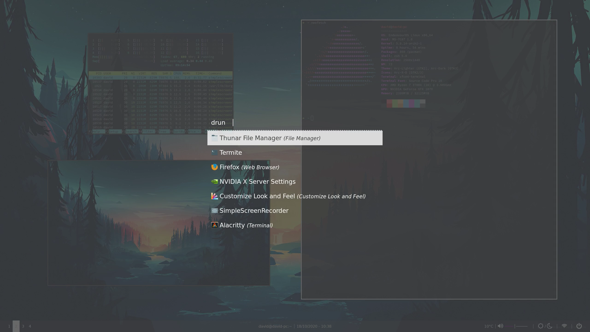
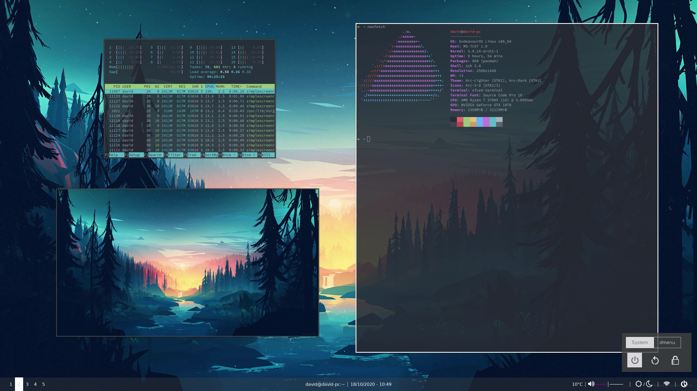
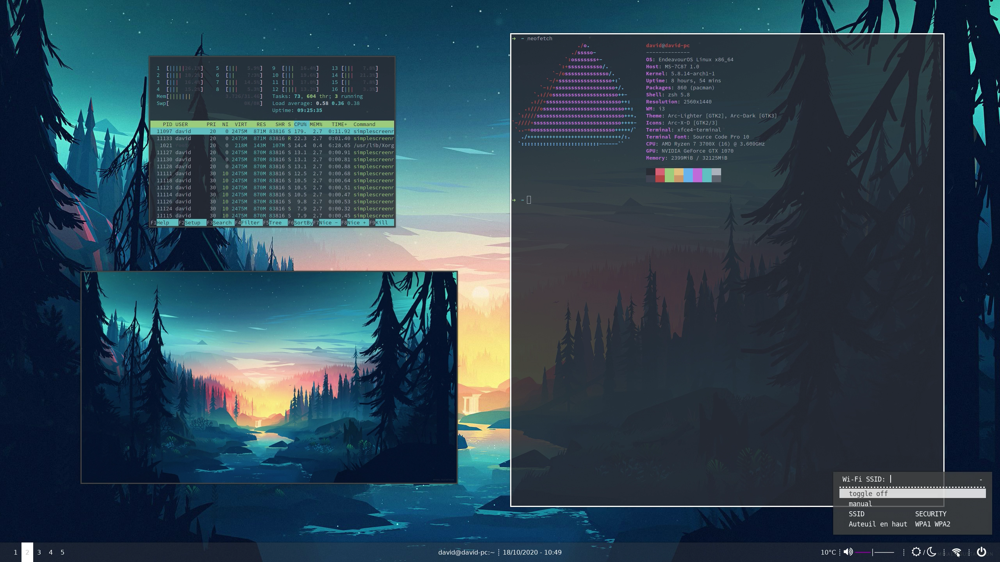
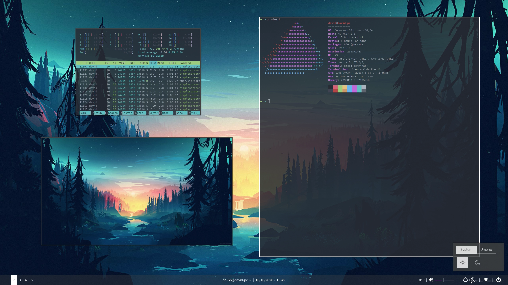

# i3-dotfiles
My personal dotfiles for my i3 setup with rofi, polybar, xfce4-terminal, dunst, and scripts to toggle dark/light mode.



Here is my setup:

- **WM :** [i3-gaps](https://github.com/Airblader/i3)
- **OS :** [Endeavour OS](https://endeavouros.com/)
- **Shell :** [zsh](https://wiki.archlinux.org/index.php/zsh) + [Oh My Zsh](https://ohmyz.sh/)
- **Terminal :** Xfce4 terminal
- **Editor :** [Neovim](https://neovim.io/) + [config](https://github.com/dvidbruhm/neovim-config)
- **File manager :** Thunar
- **Launcher :** [rofi](https://github.com/davatorium/rofi)
- **Browser :** Firefox
- **Notifications :** [dunst](https://github.com/dunst-project/dunst)

# Setup

1. Start by installing [i3-gaps](https://github.com/Airblader/i3):

    ```
    yay -S i3-gaps
    ```
    
2. Install other dependencies (rofi, xfce4-terminal, thunar, :

    ```
    yay -S rofi xfce4-terminal thunar pulseaudio dunst feh polybar compton
    ```

3. Install required fonts from this repo by copying the content of ```fonts/``` in either ```~/.local/share/fonts/``` or ```~/.fonts/```. Then update your fonts:

    ```
    fc-cache -v
    ```

4. Install my config files:
  
    ```
    git clone https://github.com/dvidbruhm/i3-dotfiles.git
    cd i3-dotfiles/
    # At this point you should probably do a backup of your config
    cp -r dunst gtk-3.0 i3 polybar rofi scripts xfce4 ~/.config
    ```

5. Boot into i3 and everything should be good to go!


# Screenshots

## Light theme








## Dark theme







